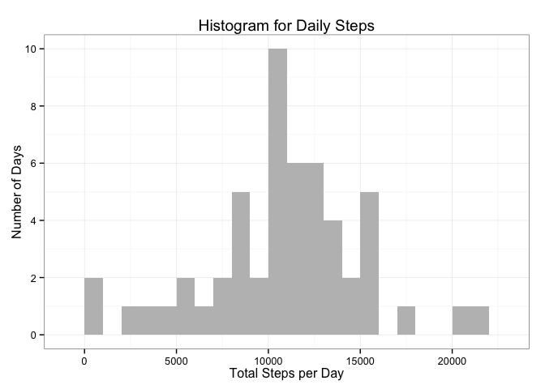
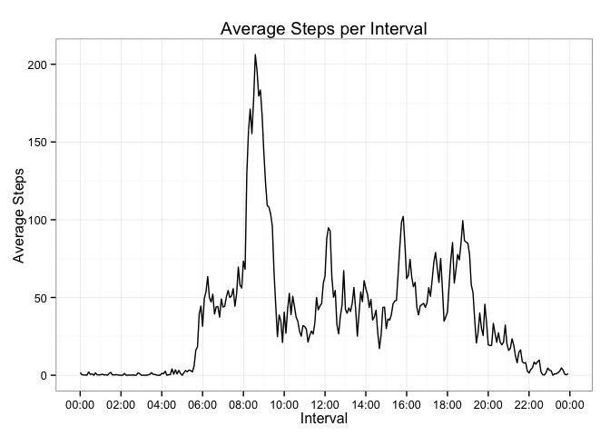
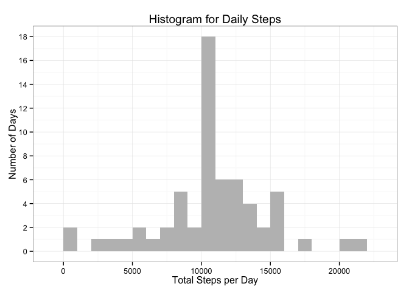
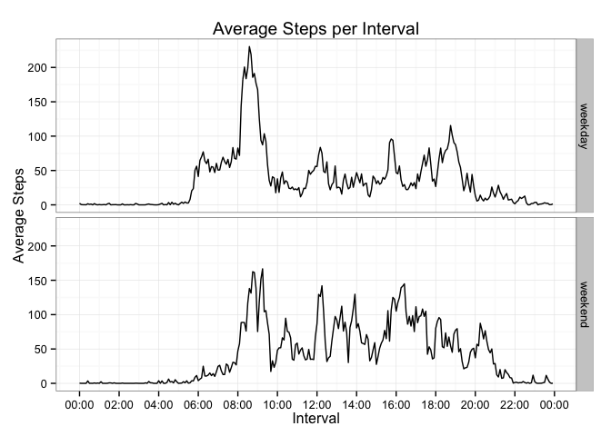

# Reproducible Research: Peer Assessment 1

The following is an analysis of activity monitoring data, as requested for the first project for the Coursera "Reproducible Research" course.

Per the instructions for this project:

> This assignment makes use of data from a personal activity monitoring device. This device collects data at 5 minute intervals through out the day. The data consists of two months of data from an anonymous individual collected during the months of October and November, 2012 and include the number of steps taken in 5 minute intervals each day.

### Data

Again, per the instructions for this project:

> The variables included in this dataset are:
>
>  * steps: Number of steps taking in a 5-minute interval (missing values are coded as NA)
>  * date: The date on which the measurement was taken in YYYY-MM-DD format
>  * interval: Identifier for the 5-minute interval in which measurement was taken
>
>  The dataset is stored in a comma-separated-value (CSV) file and there are a total of 17,568 observations in this dataset.

## Loading and preprocessing the data

First, we will load a number of useful librarys.

```r
library(lubridate)
library(ggplot2)
library(scales)
library(dplyr)
```

```
## 
## Attaching package: 'dplyr'
## 
## The following objects are masked from 'package:lubridate':
## 
##     intersect, setdiff, union
## 
## The following objects are masked from 'package:stats':
## 
##     filter, lag
## 
## The following objects are masked from 'package:base':
## 
##     intersect, setdiff, setequal, union
```
    
Next, we will unzip the zipped dataset and read the unzipped dataset into an instance of the 'tbl' class (a wrapper on the dataframe class, from dplyr).
    
We will also convert the text dates and integer-coded intervals into time objects using functions from the 'lubridate' package.


```r
unzip("activity.zip")
data <- tbl_df(read.csv("activity.csv")) %>%
          mutate(date = ymd(date), 
                 hour = interval %/% 100,
                 minute = interval %% 100,
                 time = origin + dhours(hour) + dminutes(minute),
                 timestr = format(time, format="%H:%M"),
                 datetime = ymd(date) + dhours(hour) + dminutes(minute))
```

Here's an example of what our data looks like:

```r
data 
```

```
## Source: local data frame [17,568 x 8]
## 
##    steps       date interval  hour minute                time timestr
##    (int)     (time)    (int) (dbl)  (dbl)              (time)   (chr)
## 1     NA 2012-10-01        0     0      0 1970-01-01 00:00:00   00:00
## 2     NA 2012-10-01        5     0      5 1970-01-01 00:05:00   00:05
## 3     NA 2012-10-01       10     0     10 1970-01-01 00:10:00   00:10
## 4     NA 2012-10-01       15     0     15 1970-01-01 00:15:00   00:15
## 5     NA 2012-10-01       20     0     20 1970-01-01 00:20:00   00:20
## 6     NA 2012-10-01       25     0     25 1970-01-01 00:25:00   00:25
## 7     NA 2012-10-01       30     0     30 1970-01-01 00:30:00   00:30
## 8     NA 2012-10-01       35     0     35 1970-01-01 00:35:00   00:35
## 9     NA 2012-10-01       40     0     40 1970-01-01 00:40:00   00:40
## 10    NA 2012-10-01       45     0     45 1970-01-01 00:45:00   00:45
## ..   ...        ...      ...   ...    ...                 ...     ...
## Variables not shown: datetime (time)
```

## What is mean total number of steps taken per day?

First, we need to see if there are any partial days: days with some missing intervals and some valid intervals. If we include partial days, that might skew the results.


```r
data %>% 
  group_by(date) %>%
  summarize(missingIntervals = sum(is.na(steps))) %>%
  group_by(missingIntervals) %>%
  summarize(numberOfDays = n_distinct(date))
```

```
## Source: local data frame [2 x 2]
## 
##   missingIntervals numberOfDays
##              (int)        (int)
## 1                0           53
## 2              288            8
```

It looks like there are no partial days, so we can just compute the mean directly (after excluding missing values).

Let's calculated the total (sum) of steps per day:

```r
dailySum <- data %>% 
  group_by(date) %>% 
  summarize(dailySteps = sum(steps))
```

### 1. Make a histogram of the total number of steps taken each day


```r
maxDailySteps = max(dailySum$dailySteps, na.rm=TRUE)

p1 <- ggplot(dailySum, aes(dailySteps)) + 
  geom_histogram(fill="gray", binwidth=1000) + 
  labs(title="Histogram for Daily Steps") +
  labs(x="Total Steps per Day", y="Number of Days") + 
  scale_y_continuous(breaks = seq(0, maxDailySteps, 2)) +
  theme_bw()
p1
```

 

### 2. Calculate and report the mean and median total number of steps taken per day


```r
dailyStats <- dailySum %>%
  summarize(meanSteps = mean(dailySteps, na.rm=TRUE),
            medianSteps = median(dailySteps, na.rm=TRUE))
dailyStats
```

```
## Source: local data frame [1 x 2]
## 
##   meanSteps medianSteps
##       (dbl)       (int)
## 1  10766.19       10765
```

The mean total number of steps per day is 10766.19 and the median total number of steps per day is 10765.

## What is the average daily activity pattern?

### 1. Make a time series plot (i.e. type = "l") of the 5-minute interval (x-axis) and the average number of steps taken, averaged across all days (y-axis)


```r
intervalMean <- data %>%
  group_by(time, timestr) %>%
  summarize(meanSteps = mean(steps, na.rm=TRUE)) %>%
  ungroup()

intervalMean
```

```
## Source: local data frame [288 x 3]
## 
##                   time timestr meanSteps
##                 (time)   (chr)     (dbl)
## 1  1970-01-01 00:00:00   00:00 1.7169811
## 2  1970-01-01 00:05:00   00:05 0.3396226
## 3  1970-01-01 00:10:00   00:10 0.1320755
## 4  1970-01-01 00:15:00   00:15 0.1509434
## 5  1970-01-01 00:20:00   00:20 0.0754717
## 6  1970-01-01 00:25:00   00:25 2.0943396
## 7  1970-01-01 00:30:00   00:30 0.5283019
## 8  1970-01-01 00:35:00   00:35 0.8679245
## 9  1970-01-01 00:40:00   00:40 0.0000000
## 10 1970-01-01 00:45:00   00:45 1.4716981
## ..                 ...     ...       ...
```

```r
p2 <- ggplot(intervalMean, aes(time, meanSteps)) +
  geom_line() + 
  scale_x_datetime(labels=date_format("%H:%M"),
                   breaks = date_breaks("2 hours")) + 
  labs(title="Average Steps per Interval") +
  labs(x="Interval", y="Average Steps") + 
  theme_bw()
p2
```

 

### 2. Which 5-minute interval, on average across all the days in the dataset, contains the maximum number of steps?


```r
maxInterval <- intervalMean %>%
  arrange(desc(meanSteps)) %>%
  summarize(maxStepInterval = first(timestr),
            maxStepCount = first(meanSteps))
maxInterval
```

```
## Source: local data frame [1 x 2]
## 
##   maxStepInterval maxStepCount
##             (chr)        (dbl)
## 1           08:35     206.1698
```

It appears that the five-minute interval starting at 08:35 has the highest number of average steps: 206.17.

## Imputing missing values

###1. Calculate and report the total number of missing values in the dataset (i.e. the total number of rows with NAs)


```r
totalCount <- data %>%
  summarize(missingIntervals = sum(is.na(steps)))
totalCount
```

```
## Source: local data frame [1 x 1]
## 
##   missingIntervals
##              (int)
## 1             2304
```

There are 2304 rows with missing intervals.

### 2. Devise a strategy for filling in all of the missing values in the dataset. The strategy does not need to be sophisticated. For example, you could use the mean/median for that day, or the mean for that 5-minute interval, etc.

Since intervals are either all missing or all non-missing for a given date, there's no way to use the mean/median for that date to impute missing values. For simplicity, let's use the mean value for each 5-minute interval to impute missing values.

### 3. Create a new dataset that is equal to the original dataset but with the missing data filled in.

To do this, we can use the 'full_join' function to attach the mean number of steps by interval, then replace the missing values with the mean.

```r
imputed <- full_join(data, intervalMean, by=c("timestr", "time")) %>%
  mutate(steps = ifelse(is.na(steps), meanSteps, steps)) %>%
  select(-meanSteps)
imputed
```

```
## Source: local data frame [17,568 x 8]
## 
##        steps       date interval  hour minute                time timestr
##        (dbl)     (time)    (int) (dbl)  (dbl)              (time)   (chr)
## 1  1.7169811 2012-10-01        0     0      0 1970-01-01 00:00:00   00:00
## 2  0.3396226 2012-10-01        5     0      5 1970-01-01 00:05:00   00:05
## 3  0.1320755 2012-10-01       10     0     10 1970-01-01 00:10:00   00:10
## 4  0.1509434 2012-10-01       15     0     15 1970-01-01 00:15:00   00:15
## 5  0.0754717 2012-10-01       20     0     20 1970-01-01 00:20:00   00:20
## 6  2.0943396 2012-10-01       25     0     25 1970-01-01 00:25:00   00:25
## 7  0.5283019 2012-10-01       30     0     30 1970-01-01 00:30:00   00:30
## 8  0.8679245 2012-10-01       35     0     35 1970-01-01 00:35:00   00:35
## 9  0.0000000 2012-10-01       40     0     40 1970-01-01 00:40:00   00:40
## 10 1.4716981 2012-10-01       45     0     45 1970-01-01 00:45:00   00:45
## ..       ...        ...      ...   ...    ...                 ...     ...
## Variables not shown: datetime (time)
```

### 4. Make a histogram of the total number of steps taken each day and Calculate and report the mean and median total number of steps taken per day. Do these values differ from the estimates from the first part of the assignment? What is the impact of imputing missing data on the estimates of the total daily number of steps?


```r
imputedDailySum <- imputed %>% 
  group_by(date) %>% 
  summarize(dailySteps = sum(steps))

maxImputedDailySteps = max(imputedDailySum$dailySteps, na.rm=TRUE)

p3 <- ggplot(imputedDailySum, aes(dailySteps)) + 
  geom_histogram(fill="gray", binwidth=1000) + 
  labs(title="Histogram for Daily Steps") +
  labs(x="Total Steps per Day", y="Number of Days") + 
  scale_y_continuous(breaks = seq(0, maxImputedDailySteps, 2)) +
  theme_bw()
p3
```

 

```r
imputedDailySum %>%
  summarize(meanSteps = mean(dailySteps, na.rm=TRUE),
            medianSteps = median(dailySteps, na.rm=TRUE))
```

```
## Source: local data frame [1 x 2]
## 
##   meanSteps medianSteps
##       (dbl)       (dbl)
## 1  10766.19    10766.19
```

Since I used the mean for each interval to impute the missing data and there were no partial days, the mean of the daily total steps is the same for the original and "filled-in" datasets.

However, the distribution of values does change--since we're adding 8 more daily observations with the same value, the median moves up (since the mean > median in the original dataset).

Also, the standard deviation of the daily totals decreases:

```r
sd(dailySum$dailySteps, na.rm=TRUE)
```

```
## [1] 4269.18
```

```r
sd(imputedDailySum$dailySteps)
```

```
## [1] 3974.391
```
This shows that we should be careful when using the mean to impute our step counts, because it implies less daily variance in step counts than what is testable using the data. Note, of course, that the "true" variance may be either lower or higher than the estimates above.

## Are there differences in activity patterns between weekdays and weekends?

### 1. Create a new factor variable in the dataset with two levels -- "weekday" and "weekend" indicating whether a given date is a weekday or weekend day.


```r
imputed <- imputed %>%
  mutate(daytype = ifelse(wday(date, label=TRUE) %in% c("Sun","Sat"), 
                          "weekend", "weekday")) 
imputed %>% 
  select(date, daytype) %>%
  distinct()
```

```
## Source: local data frame [61 x 2]
## 
##          date daytype
##        (time)   (chr)
## 1  2012-10-01 weekday
## 2  2012-10-02 weekday
## 3  2012-10-03 weekday
## 4  2012-10-04 weekday
## 5  2012-10-05 weekday
## 6  2012-10-06 weekend
## 7  2012-10-07 weekend
## 8  2012-10-08 weekday
## 9  2012-10-09 weekday
## 10 2012-10-10 weekday
## ..        ...     ...
```

### 2. Make a panel plot containing a time series plot (i.e. type = "l") of the 5-minute interval (x-axis) and the average number of steps taken, averaged across all weekday days or weekend days (y-axis). 


```r
imputedIntervalMean <- imputed %>%
  group_by(time, timestr, daytype) %>%
  summarize(meanSteps = mean(steps, na.rm=TRUE)) %>%
  ungroup()
  
p4 <- ggplot(imputedIntervalMean, aes(time, meanSteps)) +
  facet_grid(daytype ~ .) + 
  geom_line() + 
  scale_x_datetime(labels=date_format("%H:%M"),
                   breaks = date_breaks("2 hours")) + 
  labs(title="Average Steps per Interval") +
  labs(x="Interval", y="Average Steps") + 
  theme_bw()
p4
```

 

Based on the graph above, it does appear there are differences between weekdays and weekends. 

For example:

* There is more activity between 06:00 and 08:00 on weekdays (perhaps due to getting ready for work/school on weekdays).
* Both weekends and weekdays have the most activity from 08:00 to 10:00, but the peak activity is more pronounced on weekdays.
* During the interval from 10:00 to 18:00, average activity is lower on weekdays, again, perhaps corresponding to more sedentary time spent sitting at work or school.

This also raises questions about the method used for imputing missing values--if activity differs between weekends and weekdays, then using an overall mean may be inappropriate, especially if the percentage of missing values differs between weekends and weekdays.

